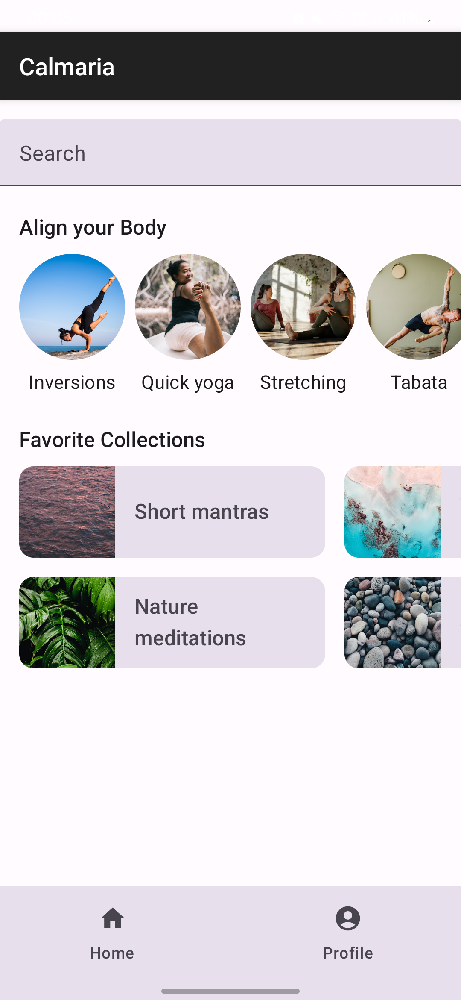

# AppCalmariaMacaubas

## Sobre
Aplicativo desenvolvido na disciplina **Programação para Dispositivos Móveis** para oferecer uma experiência intuitiva e fluida aos usuários.

## Tecnologias
- **Kotlin**
- **Jetpack Compose**
- **Material Design 3**

## Funcionalidades
- Interface simples e responsiva
- Personalização de perfil

## Capturas de Tela

<p align="center">
  
  
</p>

## Como Executar
1. Clone o repositório:
   ```sh
   git clone https://github.com/seu-usuario/AppCalmariaMacaubas.git
   ```
2. Abra no **Android Studio**
3. Compile e execute

## Créditos
Desenvolvido na disciplina **Programação para Dispositivos Móveis**.